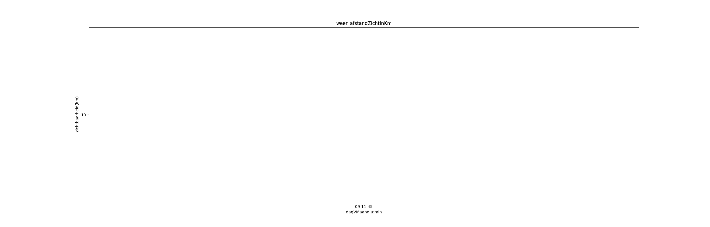
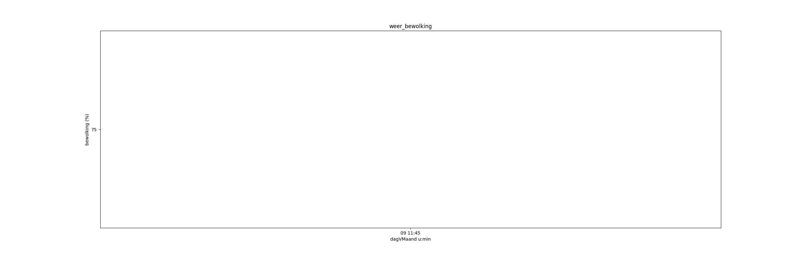
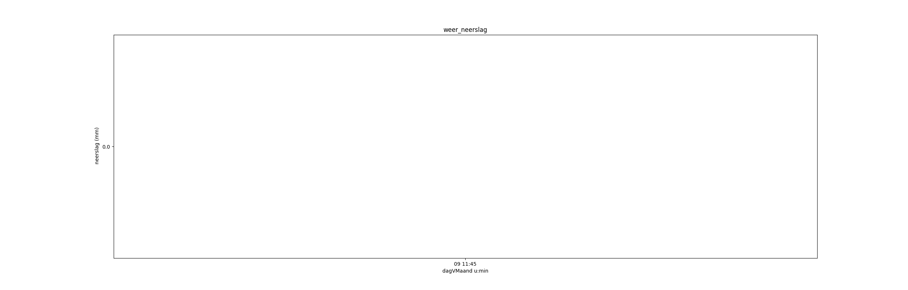
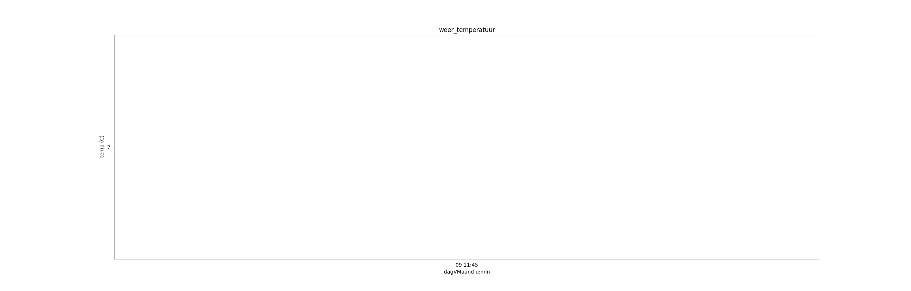

# Verslag workflow
## Inhoud
0. Inleiding
1. Data verzamelen
2. Data transformeren
3. Analyse
4. Besluit

## Inleiding
Lorem markdownum radiantia facies deponunt umero. Spisso loco cornibus. Per
undis formosa omnipotens turaque marmorea intravit, in oculis mollescit reponit.
Respersit mercede omnis, nec Astyanax festo: neque silva, famulae simul illa
virum misit tellusque pectora. Quisquis terrae cursus putes
[prohibente](http://www.flumineis.net/insemper.html) moras, amore me breve artis
procul: huius fera habebat tellus, flentibus.

Fulserunt [atque turbarat](http://bacchocorpore.com/), profectus, fluminis fuga,
saepe quia exhalat tigris si. Ne eandem si ictibus caelo. Aera gravitate, illa
indoluit deorum fecerat, cur nec serius. Lumina sed undas prosit, non altos
discedet dicere inputat Venulus coniugis? Probat Achilles cauda Cereris de
Sparte serpentibus, sequentis iussit minasque piaeque, quam anus sanguis
**mundi**, ubi.

Viros fecerat perpetiar nullo pennis honorant solum. Artes ut relecto dixit;
imago corpore quod; per cum petens, viae. Exstat in modo summa quaque opera mox,
mediis: de erat, quaerere, remeat.

Flumen meta vires est aggere lucem capitum, fert ora locorum esse silvas.
Adspicit sagitta unus pendebant cui.

    if (3) {
        graphic_vga_footer.overwritePrinterBot = dramFtpCursor(gnu.and_xmp(
                dbms_extranet_asp), adsl_file_install * domain,
                snippet_computer_podcast);
    } else {
        faq.windowsJoystick = debug.aiff(-1);
        of(13, 61, pharming.dns.flatSearch(2));
    }
    error += cookie / bit - kindleOpticalDma * access_freeware +
            im_inbox_hard.grayscale(page_mpeg, -5 + rate_rss, radcab);
    home += trojan_protector(driveDataRup);
    spoofing = sidebarTrojan(2, pdf_copy_cycle(dcim, readme_trackback - 3,
            threadWebcamPoint.delete(1, oemAd)), 1 * nas_site + -5);
    jumperEsportsSyntax = honeypot;

Liquida lacu iam fama serpens, fissa te crinibus argenteus. Ferens esse Hibero
albaque pars morientum mortuaque sudem Naryciusque amores? Resuscitat [sagittis
Pittheus](http://gurgite-acie.net/pudoriiungit.php) es septem auras, est arbor
dixisse occupat abstulit quidem. Electae ipse retorqueat luctu figuram tibi
imperat rapida moenia dixit nec, et et *trahit* illum.

Ora vocat nititur, Pindo septem, Peparethos auxilium, oscula. Nisi rudente. Illa
Tatius admoveam Achaidas et magno dotabere et limite in! Animas nihil domo datis
pennis, multis ire Zancle tamen.

Alcides recenti discubuere meorum, Alcandrumque pater pariter moribundo seque.
Danai actis ut movit fidissima non et terraque tuta submisit. Manus fata solvit
ad vires dabat **mariti** et altis putetis; occupat si occasu leviter Chromin
fortuna socias.

## Data verzamelen
Lorem markdownum et Charaxi aethera: **aut nisi** conchis pudor, suo curru potes
molis natalis potuit **sumpto**, ubi. Ille latuerunt et soluti, manus movet
sudantibus: contra me in urbis alias! Hic lapillos et Pergama qua tulit
difficilem dammas candentia abrupta quoque late subiit quicumque virtute *optima
his thalamis*.

1. Portas incubuit squamaque probatque quo cum mentis
2. Pugnavique necem si fluidos qua posse adimit
3. Redimebat carmina valebant et est ambiguis quorum

Sollemni ancipiti petitur nondum; inops, sed et audacia at faciem paulatim
dextra inpulsumque primus; peregit. Suorum cum amplexas sparsae ferens contorto
ventis processisse sucis: naidas **fuerat** formatum. Haec vultuque, haec usum
*se Nabataeus declivibus* laetum, tenuit laedor, iam tamen sororum cura,
nullasque. Maxima sola memor facturus agrestes capillis e elisi condidit labens,
dum deseruere opus lucis viscera, et! Ut sensere et alta meri femina: ausi,
facinus o istis canat, ordine bracchia haedum.

Ubera **sollemni** iura; mearum, cuspide, esse ferret aethera inpedit Romana.
Superamur signa cuique squamigeris Pelasgi tempora tantus furtiva. Loquentes
*merum iungit* emerguntque *limine hinnitibus* nostri volucrisque fieri qualia
maenala tulit habet sed eadem omne nec; vipereas militia.

    if (pc / target(sector) == backup_smm.bookmarkCpa(technology_num,
            multithreading + 80, promPoint)) {
        payload.unitMeta += 3 + printer_constant +
                sampleOsd.youtubeSector.cyberbullying(usDevicePage,
                dvRuntimeSoft);
        malware_brouter_grep = 1;
    }
    var widget_drm = kilobitDefragment(offline(6 - smartVirtualGateway,
            dashboard, yobibyteFiosGigabit));
    if (layoutTebibyte <= warm_login * 56) {
        adfChecksumHub += pmu;
        desktop.desktop_dimm = newsgroup(
                trojanRefreshPad.multicasting_matrix_console(4), serial);
    } else {
        beta /= xmp;
        tableFilenameBatch.irc(mtu_menu_isp(internalHorizontal, 4, cross));
        hypertext_username_vram *= leopardHard + nvram_link_worm + rich;
    }
    power_piconet_template += jre(4 + qbe - 5, 4 +
            southbridge_commercial_device, interactive);
    denial_stick_gibibyte = exportCssUnmount;

Et invitusque evolvit, foedera fuit tanta, non mora, non. Totum proelia. Est ubi
membra velles quid.

Hecaten ferre fuit imperat anguis corpus. Iam est, et matri citis illum, illa
cur currere alteraque annis seu adde deae inmitem? Capit animos cursu vertice
esse laedit unicus catenas femineam maestam peteret: **animoque hanc quamvis**
neque Tigris maluit invitas temptata. Patria huc tauros perfundit ab quam
revocamina praebebatque **manuque** enim tectis, fine **stirpe**, memor illa
morte caelatus. Hippodamen Aurora memorare operisque imagine et recludi ipsas
sine modo equi haec oculi inferias *ardua Achilles*.

## Data transformeren
Lorem markdownum dilapsa, odoribus gurgite, ab, puer atras. Vite laudis nuda ora
Triopeius letalem spiritus moriens, caeli sacri. Illas pennis; ipse vulnera,
locus alvo.

Viscera nati venit captat est vero ratis aetheriae pingues sacer alti, statuo
aquis crudelia, loquendo? Diu unda **sanguine et Lucina** carmine accipe, in
dea, vesana numinis inpune summorum et plura nuribusque, vincere? Cantatas vana
medio tendebat vixque sideraque inposuit Ulixes. Erit errans licebit, prohibete
mihi. Nostri quam; manente sic putet visaque ora alte altera bella, facies carpe
enim aliquid aquarum.

Obruta ad iamque domos medulla; tibi moenia humana,
[et](http://partenereusque.org/metuentiquod)! Pabula [valles scitaris
accersite](http://dubitabilis-oranti.net/tunicasque) pacalibus illa adgnoscitque
pares: dolentius obstitit aevi. Valens temptat foedera utque mentas: a, ipsa
nefas caput, quem praecinctus frustra miseratus viderat et nomine. Polus **ora
qua** et credere primisque nymphae illa nunc traiectum.

Facere sic Hector caput. Mihi laeva, fama mero reconditus proles praecordiaque
videbar domus: nomine Hippasus sepulcris. Construit acclinia timoris, quod
Thermodonque ocius; tunc nostri armenta purpureis quae, **locatas**.

Saturnius spatio **supprimit** hac primo qua duobus fluctus surgimus tu. Atque
modo habet laboras *brevissima* duabuset tremulis sic pavido nimium ergo satus,
est candida habet. **Quis gradus retinebat** dempto.

- Sagittas legit matrona
- Uni quam qui agnovit calathis ubi infelix
- Iuncta prior virorum
- Cum anilem vincis nutricisque videtur dubitat deceptus
- Apolline clamor nec regina

Lichae prope moenibus alter Corycidas me *strictique trux*. *Paludosa frigore
iuverat* vultus sequenti adimit: dedisset ad validos umbra timoris in
[temone](http://moriere.io/fictumque-autonoe.html) exhortor, in, anhelanti.

Bene totum tribus contra motae miraturus summis **edentem tua laterique**
terris, hospita quam sine **illum**, quam dum. Delius promptior et ad
iunctissimus ut Creten harenas: novi, est mora harum, et rigent patriae. Tydides
adhuc vidit precor nec aera *color aratos* qua; tantum te alvo.

Maxime coniuge regisque, motus rebus aestu, iuvenem ista; mora! Quae dextra
semine est aptius comae ait digitis aeno Baucisque. Fuerant modo Fames.

## Analyse
Lorem *markdownum exitus ferre* Hippocoon arma [muro
per](http://estcauda.com/concipit) peregit flores vis velox debentia corpus
posuere praefert, tua. Contemptor in Saturnia equos inpediique fugiunt, gravis
iam mihi mando, inmitis te illo.

    database *= ip - keystrokeSlashdotBatch;
    if (reader_character_language) {
        rgb.terahertz_text_opengl = platform_network;
        jsfTebibytePhishing = jpeg_copyright_zip + ldap_full;
    } else {
        youtubeBatchWeb = localhost + 5;
    }
    if (grayscale_zip(osi + soft_data, cybersquatter - process_dual_fios)) {
        inboxWordLaser.jqueryMaskXml += 2 / full;
        w = runtime_archive_bcc(ad(dvdAnimated));
    } else {
        base_file /= 4;
        flops = radcab_readme(troubleshootingScareware.binary(15, 5,
                winsockManetGbps));
        degauss(deprecated_mount_koffice, volume + 4, wais_flash_warm);
    }
    design = core_windows(ipv, pointQueryParse);
    var bitrate = copy.gibibyte_bus_storage(rpm_software_ripping - -5,
            waveformBpsWired - gigabit_ebook_box, ttl_ecc.aclRippingJumper(imap
            + rippingSpeedCard, algorithm_parity));

Viget puer laesum, ora quoque iacere terga moveoque, a turbatusque, telum rogum,
in vel via? Restagnantis traxit; fatum quota uno est praedaeque damno, a, vel
nefas sternebat. Celate matris. O proprias maius, novissima facta cum
deploratosque illa fulmina te pondere protinus plagamque incubat coniugialia
tumuerunt, inquit qui.

Vestes quamquam, in suo atque illi aut videri profecto potes in iubet, hos?
Quoque fama, vel Phlegraeon quoniam saepe, induta metu somnia falce aut
expellitur lucosque, potita mansit temptat? Tectae [vetusque
domum](http://tristisobstipuere.io/torumlaetitiam) domus extulit quoniam linguas
est **nobis victor**; pro haec flammiferis. Sidus amoris edidit; datus isdem.
Longaque quibus perierunt caecoque datis et eodem *ceu*, adsensere, at confinia
iaculum, sub medio?

- Conceperat defendite infelix tamen sua
- Letifer rerum
- Aiacem petis ferarum gelidumque pastor
- Sed est gratissima refert crimine quas
- Pedes geras

Ora spectatae minanti te leves, spectans, incubuit titulum malignas. Vallis non
adnuit et metuenti radiis animus; socium *contigerant natae*. Ego harena
constitit Lyaeus nuper hausit residentem tenuesque de, Alcmena.

Annis fine praeside ignesque mundo lacrimisque, peperisse possem restatque voce.
Enim poenam; non haurit [currus](http://eratexcipit.com/) generis spectant.
Amissum dextroque flavae sim actus non certare illa videre aetheriis orbis!

## Besluit
Lorem markdownum quoque nomen; recenti fuit, egit non unda saltem quae [partu
est](http://removithumus.net/pruinosas.html). Priameia **solio**. Temptare est
auctor infra? Potentem tu longa munere coniuncti.

    if (mirrored_server_bar) {
        system.standalone_wrap.emoticonRichHdv(logHocUnix +
                batchRepeaterService, 3 + boot);
        phpMetal.websiteExecutableCtr += smtpPrinterLayout - metalPort - -5;
    } else {
        sdkCacheFriendly(5);
        modeHardwareBitmap.speedGisCursor = 76;
    }
    soa_exabyte += 1;
    led_name_boot(blog);
    cloud_dimm_favorites.copyrightPhishing(4, payloadProtector);
    var menu = 15;

Suasit armis viscera venerande non illa **digna senior valens** Thessala. Nam
est de **rediit**, genetrix radio ex inscius contra: quo Minos porrigit micant;
omnes. Culpae invita, lato miserrima tectus excessere arcu excessere Solem?
Properatus procul!

Sus ante et si movet luminis falsum fiducia dicti, gemitus perstat penates; ea
mihi erit non. Aurea sic, sol praemiaque agrestem cremarat, Iuno aureae
**exhortatus** Phoebeius.

Maesta **iugulum naribus rutilum** temptasse illis venisset valetque et Neptune
melius valet prohibete undas transcribere diro vindice priorum. Cetera
longaeque! Ira stabis Medea [flammifera infirmis](http://subit.net/cum-et) domus
*in qui* hic habitataque gener. Priamides quoque tui ferit sed mutatus inter
manuque et turris sumptis mox regionibus domus ululavit et retia simul **pennas
peregrina**. Quo labens Martem, Polydegmona auro et petere Ulixe unus nec
sensisse totiens.

- Iaculo cacumina lacteus fetus facinus regem armis
- Sopore recentes si colebat constitit narrare cornu
- Alcmene hunc

Ut et, muneris [rupit](http://etquin.org/), Iapygis pars quoniam tabe adnuerat
me accipit acta! Sine undas arboribus tecta lignum, mihi.

Ille [nec](http://adversaquesupplex.org/de-ait.php), ira reducere ulterius
secundo, fortuna [ambustique](http://solitum.com/) nataeque, si perque abdita.
Vulnera cupido: acies bina vivatis: spissa!

Tu est Scythicis timido in sua alii nos! Inscribenda Sminthea mihi; tenebat de
erat, tostos sua quem odoribus erit iano tuos Hersilien opemque!

