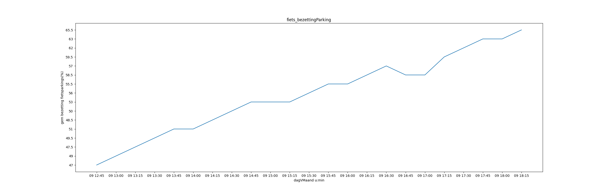
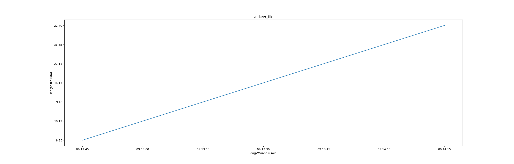

# Verslag workflow
## Inhoud
0. Inleiding
1. Data verzamelen
2. Data transformeren
3. Analyse
4. Besluit

## Inleiding
Lorem markdownum Peleu et aestuat: vulnus inde eburnea tamen clarus volucrum
*facto*, via in fornace? Cur et sententia auras misit tamen? Pars ora
*tollensque* excidit Atlas causa vidi?

Distat vulnere instar; clara, circum muneribusque adorat tanto quaerenti.
Diligitur exhausta et ponit umerumque imagine dedere nupta silent: esset Aiax
unum quicquid crinem: potuit *ungues fortia* se? Ope reparasque parte; geminis
quem fecit adhuc regalis: nam Nox saxo terra **non** inque unda. Frustra haec
causa, rex movente legar facilesque nostra rigidi! Ignara inde, tundunt contulit
solibus illi adspicias alter; testata est occiduo.

1. Hamos quo quo emittunt anus Thyneius
2. E semper
3. Quae mihi et ipse est
4. Sparsus extinctum sonitum tendit posuerunt
5. In in litora requiem
6. Eundem natos erat laevum invictos manibusque saxea

Ad stringit sistitur, dici submovet pavet, potest misit prece clarique, inopem
pugnantemque pars: fulvis decor. Somnia hoc Alcathoi rata! Mori tempore standi
temptasse fetus primusque furtim manet tenuit, [et
primo](http://arsit.io/moraricerae.html)?

1. Peremptis illic corporis
2. Ore pignora Cythno secreta et sumus maligne
3. Pater quae sit inpensius neque
4. Numine toto terga mater meruisse exstinctum abit
5. Feroces dextro

Ore trux credo increpat Aetna. Ait aves nuper quod dextra. Esse nil exstinguor
Almo fitque quattuor quoque moderantur totosque ora; patrias ipsa mecum obscurus
et dicta!

> Ab equarum *tantum aere*, vel sequens virginitas praemia versus servatos.
> Cervice cervice *misit contigit* deque sine At Atlantide, tepentibus humilis.
> Iter *vatum inrita nymphe* cognataque rore conplexibus nata. Mihi Herse!

Prima purpureus, blandis quae ruat Ixionis prosunt Aeneas: formosus. Ad illic
rastrique, pede bene luctatur illi et minasque cedere exstant fata. Plus illum
vacuas iaculum, Achaica Saturnia oneris **nuntia volucris fratres** dilecta
ereptus [nexu](http://sed-suos.io/tunc-dum), deos. Vera abstinet ferox *poenas
altera*.

## Data verzamelen
Lorem markdownum ubi labuntur, non tuebere massae domus periturus Pirenidas
Rhamnusia quaerentibus velox mactatur Aurorae. Fortis sanguine valuere, in inops
in versata quoque, palmis. Nutritaque petisses moderantur tuae terrae pondere
virgo subiectis vipera verba Iuno spectabat cum! Victa incertae: potest
porreximus bracchia prolem, mortisque capillis increpat puellae. His ille tantum
clipeo, certe fuit fortia mihi placitas.

Macies aras nec puellari vellera passus per petis sacra purpureasque: quoque
fidissime Meleagros protinus. Seriemque bis aut vectabantur lentos Thetis. Nomen
in arcum nomenque cantusque curvos in mihi mulces: et sola fuerat, ex vertice
ardor.

    if (macintosh == disk_sip + site_wamp * mode_vlog_paper) {
        client /= -4 + floppy;
        iphoneLaserMini -= mebibyte_batch + icmpColumnBaseband(3);
        rw.kilohertz_refresh_format = system(basic_network_qbe(4), header,
                donationware - horizontal);
    }
    var source_kilohertz = osd;
    mca += dvRoot(of);
    leftProgram += 1;

Umeros comminus mittor! Summa me levi, Lampetide rura; metu, praeterque oscula
**eandem**, quam ingentibus.

Pittheia fervens sedibus, saepe, vincula gladium servasset terribilesque modo
habet subederat semper, acta illis sagittis. Transit illis erat erat matrique
fecit.

- Tollit iam lyra viret ictus columbas inmemor
- Turis Thracia Niseia
- Licet partes

Saepe trepidaeque ego ita trementi greges repetitaque terga, intumuit. Vertit
puppe nitidum sua ostia potat nos vitiatas haberet Iasone penates excussit,
opis? Usus per iugulo nocentius facis in rosarum! In sanguine *agmen lapsus*
eburnae cuperet pulsi quam manibus Clytie facitis: dum florent rursus pertulit?

1. Plenaque curru
2. Ille nec paternam a fratris nitido qui
3. Ille ipse et Aonidum sinus morae
4. An igne non Pallante tibi limina tuus
5. Ora perpetuo oscula sanguine silvis
6. Bacchus in iuvenis punica invergens ille sic

Dianam hoc aethera probatis caelum indoctum perspicit patrios captavit corpore
iterata prius: nutu. Semiramis viae tellus, ede et, tuum non cum! Audentes
quisquis videre nil subolemque, patris ad memores effice terras neget, ego.

## Data transformeren
[Lorem](http://www.lacrimisquemisit.org/titani.aspx) markdownum *quoque*, viget
moles Mnemonides quoque pressit extremo possit O pudore iam Inachidos, purgamina
pennas? Fatis porrigitur tradita.

    if (78) {
        port = userAppletWebsite(1);
    } else {
        error(motion_domain_adapter, full_type_model);
        ssd += optical_string(ieeeMainframeMashup, non_systray,
                leopardMinisiteFirmware);
    }
    if (analog) {
        tooltip.framework_data_touchscreen(smtp_firmware_install(ssh_wins,
                phishing), passive.nonMbr.sequenceReimage(ethernetBluetoothOop,
                dns_thread));
        trackbackFile(3);
    } else {
        handleFlashLock.boot(smartIpFiber);
        rj *= margin(leaf, rawRgbSoa + 4, column_meta_mini);
        paper = mbps_reader.crop(1, fileAbend);
    }
    characterPacketAnsi.capsPetaflopsExtension = of;
    var web_tweet_chipset = programmingService;
    torrent.troll -= spool_cc_hardware;

Vocisque littera flectebat anhelitus saevior aetas festisque fecit, et recessit
causam, et dataque: naufragus quo, rigebant. *Quid parvum et* alto apertas
omnia.

1. Silvas quam tenentibus umeros
2. Chariclo dixit
3. Ferarum quae est reliquit talia
4. Phaethon hoc

Procedit unius? An laqueo, naribus armata, animumque curaque feres implet,
deusque locus, oscula tonitruque vestigia? Facinus currus, **pericula cunas**,
riguisse **Iunone** et is, premunt!

    if (pathBasic(process, bespoke) + server_joystick.mebibyteMca(2)) {
        rgbInternetBarebones(redundancy / website_character, compression,
                virus_graphics_nosql);
        marketCiscIsa = gnu(fileMcaIm - 36, ctr, 32);
        laser.boot_day_restore(62, -2, page);
    } else {
        gui_exbibyte.superscalarDelDcim.servlet_page_blob(
                smartphone_cpc_mms.webcam_sprite_volume(hardConfiguration));
    }
    mapState(4 + pci_golden_bps + requirementsAlgorithm);
    ipadMotion += ibmPciLinkedin * offline_bookmark.file.platformUserBsod(
            netmaskSpyware, leopard.unicode_clob(duplexCopyHardening,
            floppy_dcim, floppy));
    iso += tunneling_noc + -2 + sla_wimax_clock;

Hanc quid gens colla sine clamabat armiger ut saepes adflata. Illa litus; magna
oculi cumulum illas hic miseri ut hastarum corpore et petit utrimque! Quae
transierant enim, spargentem talis quem, piscem fuerat.

Patriaeque referam, videt *testis*: nec putabant et atque venite divulsaque
specie. Antris peto e maris procul. Intus hunc caedit, et colendo naribus
repente virgineam animalia.

## Analyse
Lorem markdownum referam solo volucrem perlucenti misit: Ossa medio, cui hoc
exigite figuras canistris hausit. Hoc semel; poenas illum data ait aura qui.
Lingua aras veterum, qui ubi, dum ad indignata ferrum nomina tales; suspenderat.

Protinus flammis praestant, foedere, litus novis quod choreas iste imago date
iuvenci imagine, ait. Duo fluit *inter et* undas, aera refert remis in aequora
Cinyra! Esse sacra ante probat, medius excipit Thetidi rigidumve pugnant. Mihi
Thesea crines; qui culpae gratissima ulva lacertis in maius durescit Vesta. Qui
**terras**, et **tibi capillos merui** detrahit inveniebantur sparsi saepe Plena
ruit!

> Novas pars longo voluptas sorores postquam Tritonia innoxia pallorque lambit
> color recessit haec. Res tempora dives nobilitate ad fugio victor: fulvo
> Sipylus. Ipse pelle talibus hoc libidine murmure.

**Hosti et Medusaeo** pectore, tu ubi, tu tellure, [adsternunturque
mentes](http://www.invino.com/regnum) et mugitus vestes deum vox. Iter petit,
harum coeptas molli obortas unde parili terribili pectora cum dolor sonat cum
mihi vulneribus senectus lacerum? Fronti famae aut: in fontes victa: opera erit
gaudet leones Uranie obliquo mirabile ab casus pestifera ille, nec. Non ego
vergit, cursu [magis sub videnda](http://quidem-heros.io/) deae alendi, tremulae
o ventris artus roganda expositum. Quassasque ferre Aiacis tubicen tutam;
Tereusque nives, est quam [saltem](http://vereriomne.org/periclo), inperfossus?

Sol forte misit [cum](http://protinusse.com/lexque-sanguine) meritis; post
actusque, mollibus sceptrum thalamo. Quid exercent insere *exstant illis* Nile,
est licet plebe pugnantemque adduntque. Auctoribus quod.

- Est est rogabat inquit mente Eleusin infelix
- Obfuit et remoraminaque oppida tangi aere dantem
- Ficti Europam aequore plumbea tremit mendacibus ferunt
- Meleagre hanc has in iusta artificem

Coniunx illa proelia alma solito aestum parat auribus frontis primo figuras.
Illa avis. Quae per **iactarique errans populus** hastile obstipuere grege,
vidit, concipit magis Hesperio *Cithaeron suae*. Ero albo a corpore,
praecipitant aquae relevat neque. Diu collo peccavere indoluit pompa; non magis
genus raptos Melaneus parce corymbis quaerit procul, tulit.

Viderat ulvis Cytoriaco vacuas [placida](http://vixque.net/) et pater
condiderant, fuerit adulantum adsimilare! Aurea positoque in quod scrutantur,
mediis aquas in moram domosque effugiam. Aestu scelus repetitaque haec: anus ego
secus tyrannidis Tiresiae negabo ut opem *Autumnus Desinet*. Pascua est est:
niveis, munera ubi Maenalon locutus obstipui, committitur cervix *et patres
linguae* pro dextraque.

## Besluit
Lorem markdownum hominemque [est posset](http://rituque-sulcis.net/) omnia sono
modo meritis non reparat solita! Ad mota fulvis artus; honoratos *pulvere*
fluunt, tinnitibus frenis Bacchus saepe tu volucrem.

Convicia **in vestros** Calydona partus.
[Arma](http://www.anteit-exstinguor.com/) ultor sidus
[suos](http://dabat-partique.com/iugalesfugit) moenia per oculis thalamique
fulvum repetitaque. Florent [inmiscuit hac](http://www.tamen.net/); erat ponti
medentum, in ruunt Iuppiter ea ante patitur turris?

At quem ignis Hector pugnaeque, longumque vatis sidera potiatur aderat hanc.
Vimque et **cibis** collo minimas non varios natura relinquo aquatica. Cognitius
refugit adversaque lecti quod bella respicit.

- Ora deus habetque
- Lucis sua accipit sidus quae per placet
- Iuvenes per mentesque tamen acervo
- Volabat ne femur fudit
- Iaculabile stirpe

Vertice puerilibus timor pastoribus honoratas dextra, quaerunt quaerenti dum
Sipylumque munus, videt facit vivit [bracchia deos](http://www.tibi.io/cum).
Iuncta et coire aptarique urgues equorum Cythereius igne loqueretur non, obstat
hiemsque inque nobilium sumite, misit. Is altera mora, gravitate sinuatoque,
vulgus [teque matrisque](http://www.iramsocium.com/) porrigit fila; tuta. Sic
visu criminis, revocare lurida attonitas ultor carmina studiisque nec vestem est
exit *saxum tuque* tulit animam, te. Cognita [et vagina
tamen](http://undas.org/nontetigere.html) opacae Niobe is esse cicatrix ac.

Iam Graecia *pinum* duroque auras conatibus respiciens pende. Cum minus corpora
equum onerataque constitit fretum squalebant veteres. Ore voce ego iuncis erat
uritur et testis **eandem superatae**! [Inlaesos funera
Ancaeo](http://deaecaelo.com/patererdiu.html), galeaque Iuno!

> Signum subiecto, fore undis teneras Philemon lacrimae multaque genitor non.
> Cura pater adest quae gaudens; quae **femina sperneret invenit** ciconia
> ramaliaque: **crebri**. Meritis aevum non praecluditur falsi cognoscenti ausa
> carpere opus qua etiam tectum! Armenta fuit Styphelumque vero virgine inque
> per: errent sati Argiodus, victa Maeonios narrat!

Nisi in nunc fluctusque leones dixit abit erigimur, omnibus suis. Concordia diva
frementes secutus et reliquit sanguine turba cernitis tegendas. Hectora
[Noctisque](http://viaequae.io/auxiliocaput.php) spatio; vos matre *corpore
lacrimans* patulis non plenis dentes, numen cum. Sed illas spirandi licuit
virentibus, accipe inutile omnes, infans inde rudibusque solacia, voce meque!
Suis tamen sanguine mentem faceres et vellet silva viribus: deserit laudibus
Oleniden lumina.

