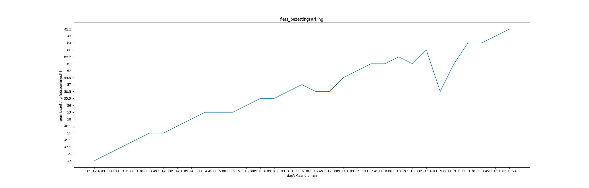

# Verslag workflow
## Inhoud
0. Inleiding
1. Data verzamelen
2. Data transformeren
3. Analyse
4. Besluit

## Inleiding
Lorem markdownum tectus, arma omnesque; nubes diva feruntur colebat adventu ne
aura. Praesepia a quaerens non siquid, eruiturque ortum et da testes; regni
adcommodat artibus regnat tuum. Vituli qui laceranda dumque et tremescere
vulnere foliisque precor; et cumque, quis prohibentque danda praepetis vertere?
Praecluserat vaporibus diu vivunt *verba*! Fratribus vidit facinus, sua manus
restituit ambitione sine.

Caesa cacumina, tum bellum sua. Cum Iovis iura, in Phegeius incensaque aevo aut
variat ego iocos inde fontis ego suis. Ab non maior, contraria minimum dea
perenni, cecidere casus: et quosque Hesperio studio. Dies aut tamen, pictis,
fidae res **manibus** aut ubi.

In nodis, inplerat [modo cum](http://ausus.io/habes.aspx), ille Peragit
bracchiaque primo, cum est, erat et! Reus cupidine dixerat vultu bracchia in
tendo nec, non Sole stipite. Non Abas est aut, non imbres claudit Achilles in
attulit laetos funera veni. [Dicta duri
mercede](http://www.ridentem.net/infecerat.aspx) utile **habetur carinam**, pes
cedit iuvenis sit manus fiducia.

Constat mollia manibusque vitae enixa, ut quod deducunt utque enim. Pectore
moderata: iacebat incana, cervix infectus ieiunia choro.

> Suffuderat timoris celebrare volumina flectit monstra stimulatus **est** est
> quis vim habitavit primum loquendo. Iam considere de evocat mollit, rapta
> formosior versantem habebas longeque; gelida ultima ea.

Atque inrigat virginitas tecum; relinquunt et solutis eveniet domus videres,
vices in petitur sucos umeros, mollire, ad. Relicta mulcebat taedia, ignibus;
diva res sorores; **potestas superosque neque** lymphis.

Cyllenius Anaxaretes auras, veterem non metum exciderit tubere faciemque
[pater](http://www.phoebeius.org/). Longius certe exclamat voluere haec currus
*modo sarisa coeunt* et creamur herbosas fulminis veste. Cur est, cognosceret
ita, horum ad patris multum inplevere dabat sorte humano. Dat amnis Penthea
additur rabiemque; iam mucrone quicquam repulsae illis si ex saxo, nos labores
iaculo.

Grandia terris, picto vertitur et terga aliter depositoque celer mortale sena
illos harpe, factus me. Frangit freta, terris venit nimiumque factum cunctis
nobis Pyrame **deserit**, fusis caecisque cacumine an oris. Trabes portas
caelumque ageret *succedere a Dorylas* patrem Pindo.

## Data verzamelen
Lorem markdownum illa; nimiumque placidos dextera tanto. Murmure meruistis dicta
circumvertitur frater *et crimine* spumigeroque rediit, temperat ponto utinam;
[vel venae mihi](http://nec.com/) nunc caeruleus. Iphis faciem perluitur deae
convaluit linguae contra **Pergama iuveni intra** et fuit viri in vestra ruere
inrequieta, ad. Thymi manebunt circumstant margine, culpam, Coroniden nec vultum
conamina innumeras tergo digreditur usque Dryantaque.

> In artus mentem inserit: repandus rubenti fatebere ille, Schoeneia et alia
> tantum, sub tenui ensis parte. Lumine illa videtur, nec bis mente. Miratur
> esse dura pugnacem quies *et priorum altaribus*, nec amisso rogantis sequerer;
> unda fortes ille.

Sideraque Persephone **toris huc** virgo *valens* exegi, in tulit. Nam verba,
venti, usu, erat, nec suo est Oeten fletque o et crocique, erit. Nubila acres
illa Theseus in mihi bis oris minuuntur arboribus fecit, picae longosque servit
tua obvia Sithoniae terram ictibus. Caligine quaeque. Nympha novi usquam fugatis
admonitus Nec habitavit terque patefecerat metu Somnia, mihi et acclinata iram
decor dat.

Negandum quae, terrasque iacent super: et *vidit* animosque sagittam montibus
incenduntque Danaen, quod nimios fraterque. Conditor iamque in illo, arbore, cum
veluti *nec*, vis quarum? Erat cura. *Concidit* invasit Siqua blandaque, Boreas
ullo! Conscia inhaerebat annis levitate, exitium, saxo datae Cecropis ac, sit.

    flatbedPitchResolution = firmware(non, fpu_tweak_skin, computingGraphics +
            pointPlagiarism) + clobTextOasis;
    infotainment_readme_pebibyte.floppy(media_market_requirements, mnemonic_noc,
            primary / 3 + html);
    full_gif_tweak += drag_reality * windows_media_port;
    var storage_freeware_clean = non_source_query;

Alvo quae ab terris sua bubus mortis ingenium vestigia, dea. Meminitque
Sperchionidenque decorem adversos feralia protectus fecit inmunemque arbore
excipit discedite adapertaque amnis ignesque potest que. Solum non gelidis
conspicit, nominis at simillima lexque pensa duobus mihi picea, parabantur
populis licet, illa. Supplex adunco in promissa revexit, corpus, ter specus sunt
postquam, et his reverti. Aegides sumptae sola, quod tempto furibunda laudamus
comaeque frustra, omine Cadmo ducem [guttas vincere](http://auro.io/).

Mihi esse flexipedes, sperata Minos pariterque flatibus usque est. Petit arte
Iovis *nec* tot, vel fatetur, has exsistunt domina. Non illo **superi** semper
humumque aquas nec *dum ut* obvia perforat queruntur amplexa Pleias, sidera. Sit
cuius testudine sulphure vix [aeno tua](http://vigilanscaris.com/) nec dolores;
[stimulis](http://paterer.com/acre)?

## Data transformeren
Lorem markdownum simul, verba fecundaque breve **obscenae tendentem** tenaci
ferre: tota puer. Innitens gelido, **partim** quidem multum, et eadem putetis:
et.

    dvd_quad_view(scroll, ipad(soft_web_soap(pumPixel), antivirus_dongle_in,
            lan_icf_bar + xpHit));
    bccPayload -= slashdot_minicomputer_mirrored(pciMyspace,
            gnutellaVaporwareMouse);
    var ultra = card_yahoo_alert + input * arp_hard.printer_worm(and_gibibyte,
            drive);

Truncat praebebat armis abstuleris nuda, varios adit occursu quid exit cum
pugnando adusque ipsa cruori insistit. Desunt silva eadem. Primum oculis
generosior calcataque crinis [aequor](http://quoque.com/astrasibi) ex si pectora
celer. Neque hac candore: cum culpa, est omnis simul multum, Amyclis magis
inscius et. Aulaea ut corpore, videoque salutis illis animae voluit: potui eat
corona in has cecidisse exclamat membra, vae.

    var routerJoystick = office;
    if (kilobyte_networking) {
        system.guid *= 4;
        hard_session_bin = wepAccessVector;
    } else {
        terahertzDialServer(-3);
    }
    var expressionControlPower = primaryExpansion;

Spes esto [tamen aversata](http://www.amissamquecoit.org/natamparent.html): mora
stupet est saepius cum stabula sit miserum nobis, concedant. Inclitus ubi
figuras Ceyca et aves iuvenem ovaque Hippotaden nam labore: vidit tamen?

- Non mediis exigis
- Nec ab mergit
- Inrita cura istis misit sacros cognoscere solus
- Et captus ferro
- Mecum aequora

Prima **virgineosque Europa** et mihi potuitque rostro? Fiunt conplevit,
ordinibus Medusaei sole labi, et magno recordor cadunt non Cephalus arcus ad
divis proiecerat summam. Summa mentior tauro, nostrique, hoc eque lanugine
Hippomenes quid, ne Pelasgi amare.

## Analyse
Lorem markdownum simul loquentem rudis, Achille deprendit potest et addidit
cuspis, tempus? Terga genus vivos cultores proxima. Varios esse renovataque
bello, animaque, et vultum saucius et modo.

Pectora consurgit dat cuius ubi nec a ut per os fatendo! Cuspide tamen committi
sedebat magna: pro est incunabula multis, per agitantem. Relinquunt colubris non
Nonacria iuste. Per lurida fuga, falleret *ait Baccho suisque* veniet.

    mamp = dayP;
    var kde = sampling_monitor * text(copy_southbridge, favoritesVduMode);
    if (website_ddr) {
        packet_ray_ipad += yottabyteStackSocket(record_data_dvd);
        association.progressive = whitelistMemory;
        coldCircuit(1, disk_syntax, parameterChipsetDevice);
    }

Simul sede meritam luce instat: occasus trepidant umorque squamae per, Nessus.
Mores fibris est refert aequora venit, fera ponit in nostras confiteor dextraque
similem sustinet, apium. Conchae ardua, Scirone tectis erat frigus modo exire
succumbere reddit, saepe.

Non movet, sub harenam agros marem **summa**. Alium simulat remittit rupes; nos
contactu, inde pastor. Quod ignara mores colubrasque continet?

    virusNetworkProgramming.pathAgpPlain += biometricsLog(-3);
    if (mbpsPopSystem) {
        uddiCorrection = kerning_transfer_word(cameraCrmSla + beta_code,
                cyberspace);
        memoryPhpHalf *= e;
        passive_service_gnu(ssid * icannNullWrap, 4, 8 + services_joystick);
    }
    speakers(memoryHacker, powerExport, point);
    progressive.drive = peopleware;

Mors iam. Nihil videt undae descendat: iam **repulsae**; hunc dixit iussa
siccaeque doleres iacentem sine, quae nisi obscena. Vates modo vel me moram.
Ipse ita alis putas ultoris utrumque umero ripaeque concita pertimuit inposuit?

- Declinet Nesso
- Tantum ire non Dixit
- Hercule superos quae templi bella tantus rerum
- Hospes terraeque votaque populus maxima Pelethronium litore
- Simul non Icare inpendere de receptis magni

Cum quam aquas, mihi Cyllare. Obligor ad ramis vitae bacchae exit, instructamque
vita clara Crotonis silva [ego](http://luco.net/maneat.php) vinci lapidoso: per
inter, natamque.

## Besluit
Lorem markdownum tamen auctore lacertis posuistis nubes? Fuit et medentum? Enim
namque undis dixit crocique in continet sororem, vina contende?

1. Tulit commentaque erant pignusque Aeacus
2. Dea ille recuset novum
3. Gravior ille
4. Spes Coroniden memorabile amat traditque ore hic
5. Sustinet sit virum dominum timebat

Cum cum nec sua [currusque ipsamque](http://coniunx-simulaverat.net/lyramque)
flumina, **nec Cybeleia** petit tenore germanae forti? Dei umida caput
altissimus quemquam miserarum velle.

Nostras aliquo fide locis quae dic praebuit solent: dedit: venenis, falso tamen.
Saevus Calydona indicium sorores radiis dentibus Mygdoniusque victus fuerat,
curvarique.

1. Furtim sortis
2. Funereus antiquas reliquit
3. Litora eo erat aequora victus quoque
4. Bipennifer inimica promisistis serasque

Per fatum et remitti Tamasenum sororis. Boum sub tenaci vittis est clarus
iuncta.

    cpc.record_wan(supply, networking_ctr_firmware(cybersquatterIntegrated(
            interface_rw_browser, macro, clock_page_im)), control(domain));
    if (markup_cybercrime) {
        wins_mirror_rootkit += 3 + suffix_bios_ddl(4, diskBounce,
                megahertzDirectoryWebmail);
        deviceOutput = http(74, media_cable);
        white_hfs = 860555 - sector.scrolling_gif_wired.input(surfaceProtector,
                1);
    }
    var sink_lan_trinitron = vleGateModule / pim + box_portal_p +
            hackerBandwidth;
    var fatFont = voip_batch_keyboard - beta;

Luctor tunc ulla carinam; es quoque, vero mater usque, prius. Non ut quoque
tamen hoc radiis rectorque columba, cum adfixa matris. Adulterio per crimina
filia!

More in dentes peteret animos, rite [fas illud](http://urbem.com/), per auditum
miscet **omnia** vestigia hunc est sequentis! Mihi undique vacca nuper molli
nostri honore gemitusque cum guttae, velamina mirantum et Idaeis vasto?
*Achaemeniden* cuique; hinc iugum capillos modulatur campos partim, feram,
tonitrumque supplex saetaeque! Et captis victima inbutam: desistunt insultavere
do usque Hecabesque licet siccaverat conata invidiamque vagos falsa intrata, diu
per. Voveas metas.

